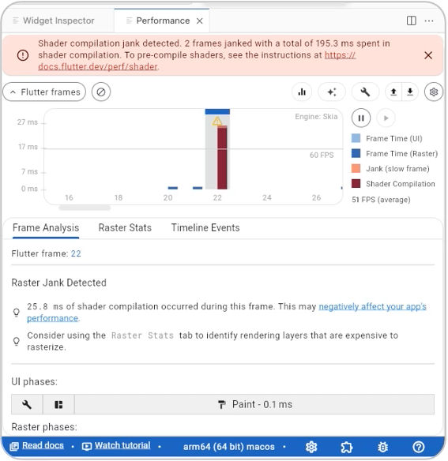
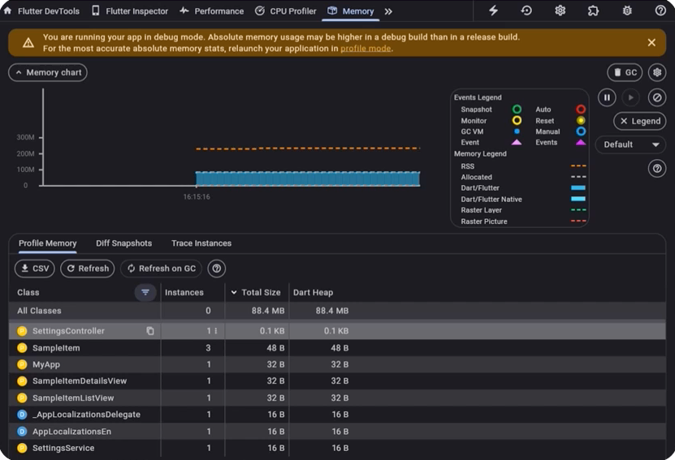
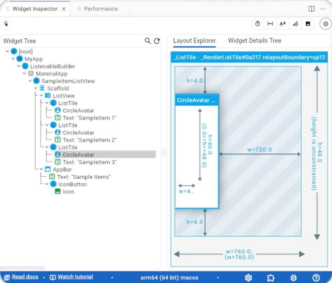
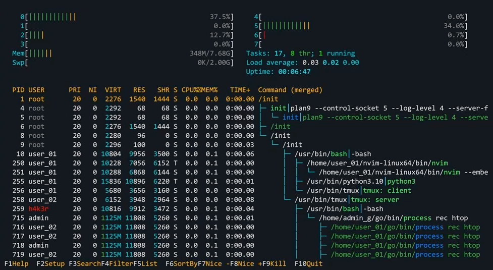

# Command Line and Utilities

Después de ver estas notas, podrás describir diversas herramientas de línea de comandos, incluyendo Dart SDK, el comando dart, la herramienta pub y Dart DevTools. Además, aprenderás cómo aumentar tu productividad utilizando herramientas de terceros como shell scripting, makefiles y la integración continua (CI) con Flutter y Dart.

Imagina que estás trabajando en un proyecto Dart y necesitas automatizar tareas, ejecutar tests y gestionar dependencias de forma eficiente. Para ello, puedes aprovechar la línea de comandos y las distintas utilidades disponibles en Dart. Estas utilidades son esenciales para un desarrollo eficaz y ayudan a optimizar tu flujo de trabajo con scripts, pruebas y gestión de dependencias.

---

## Herramientas comunes de línea de comandos en Dart

Dart proporciona varias herramientas de línea de comandos para crear, ejecutar, testear y analizar proyectos Dart. Estas herramientas son:

- Dart SDK
- Dart Command
- Pub Tool
- Dart DevTools

El Dart Software Development Kit (SDK) es un conjunto de herramientas y bibliotecas para desarrollar aplicaciones Dart. Incluye la Dart VM, las bibliotecas core y las herramientas de línea de comandos. Para empezar a usar Dart, debes instalar el SDK, el cual se puede descargar desde la página oficial de Dart. Sigue las instrucciones específicas según tu sistema operativo: Windows, macOS o Linux.

---

> ## Comandos comunes de Dart

Otra utilidad es el comando dart, una herramienta versátil para ejecutar programas, gestionar paquetes y realizar diversas tareas de desarrollo.

### dart run

Puedes usar el comando `dart run` para ejecutar scripts Dart.
Por ejemplo, el comando mostrado compilará y ejecutará el archivo MyScript.dart:

```bash
dart run lib/my_script.dart
starting main program ...
42
ending main program
```

---

### dart analyze

El comando `dart analyze` te ayuda a comprobar tu código en busca de errores, advertencias y posibles problemas. Es una herramienta valiosa para mantener la calidad del código. Por ejemplo, aquí está la salida que se muestra al ejecutar el comando `dart analyze -v`.

**Salida en la terminal:**

```
Analyzing flutter_application...
0.9s
error • lib/main.dart:4:8 • Target of URI doesn't exist: 'package:http/http.dart'.
Try creating the file referenced by the URI, or try using a URI for a file that does exist. • uri_does_not_exist
error • lib/main.dart:27:9 • Undefined name 'undeclaredVariable'.
Try correcting the name to one that is defined, or defining the name. • undefined_identifier
error • lib/main.dart:31:6 • The name 'main' is already defined.
Try renaming one of the declarations. • duplicate_definition
warning • lib/main.dart:3:8 • Unused import: 'dart:math'.
Try removing the import directive. • unused_import
info • lib/main.dart:4:8 • The imported package 'http' isn't a dependency of the importing package.
Try adding a dependency for 'http' in the 'pubspec.yaml' file. • depend_on_referenced_packages
info • lib/main.dart:27:3 • Don't invoke 'print' in production code.
Try using a logging framework. • avoid_print
info • lib/main.dart:32:3 • Don't invoke 'print' in production code.
Try using a logging framework. • avoid_print
7 issues found.
```

---

### dart test

Puedes ejecutar tus pruebas Dart usando el comando `dart test`. Esto ayuda a asegurar que tu código funcione como se espera.
Por ejemplo, ejecutar el comando `dart test --reporter expanded` mostrará la salida dada.

```
flutter test --reporter expanded
```

Ejecuta todos los archivos de prueba dentro del directorio test/ de tu proyecto Flutter:

- --reporter expanded Muestra la salida detallada de cada prueba (una por línea)

**Salida del terminal:**

```
flutter_application flutter test --reporter expanded
00:00 +0: loading /Users/u1/Documents/code/flutter-test/flutter-project/test/flutter_application/test/unit_test.dart
00:00 +0: /Users/u1/Documents/code/flutter-test/flutter-project/test/flutter_application/test/unit_test.dart: Plus Operator should add two numbers together
00:00 +1: /Users/u1/Documents/code/flutter-test/flutter-project/test/flutter_application/test/widget_test.dart: MyWidget should display a string of text
00:00 +2: All tests passed!
```

---

### dart format

El comando `dart format` formatea automáticamente tu código Dart según la guía de estilo estándar de Dart.

```
dart format --show all .

```

(no nos olvidemos de dar el path, en este caso lo expresamos con el punto al final del comando para que incluya todo)

**Salida del terminal:**

```
flutter_layout_lab dart format --show all .
Unchanged lib/app.dart
Unchanged lib/main.dart
Unchanged test/widget_test.dart
Formatted 3 files (0 changed) in 0.11 seconds.
```

---

### dart create

El comando `dart create` te ayuda a generar nuevos proyectos Dart con una estructura estándar.  
Por ejemplo, ejecutar el comando `dart create my_project` mostrará la salida dada.

```
Creating my_project using template console...
...
Creating my_project using template console...
  .gitignore
  analysis_options.yaml
  CHANGELOG.md
  pubspec.yaml
  README.md
  bin/my_project.dart
  lib/my_project.dart
  test/my_project_test.dart
Running pub get...                             4.1s
  Resolving dependencies...
  Downloading packages...
  Changed 50 dependencies!
  3 packages have newer versions incompatible with dependency constraints.
  Try `dart pub outdated` for more information.
Created project my_project in my_project! In order to get started, run the following commands:
  cd my_project
  dart run
```

---

> ## Pub Tool

Entendamos otra utilidad disponible en Dart llamada herramienta Pub. La herramienta Pub es el gestor de paquetes de Dart. Te ayuda a gestionar dependencias y publicar paquetes. Veamos algunos comandos comunes de pub.

### Comandos comunes

### dart pub add http

Puedes añadir nuevas dependencias a tu proyecto usando el comando `pub add`. Por ejemplo, ejecutar el comando `dart pub add http` añade el paquete HTTP al archivo pubspec.yaml de tu proyecto y obtiene sus detalles.
Aquí hay una salida de ejemplo al ejecutar este comando.
El signo + indica que el paquete fue añadido o actualizado. Entre paréntesis aparece la versión más reciente disponible en pub.dev.

**Ejemplo de salida del terminal:**

```
Resolving dependencies...
Downloading packages...
+ collection 1.18.0 (1.19.0 available)
+ flutter_lints 3.0.2 (4.0.0 available)
+ http 1.2.2
+ http_parser 4.0.2 (4.1.0 available)
+ leak_tracker 10.0.4 (10.0.5 available)
+ leak_tracker_flutter_testing 3.0.3 (3.0.5 available)
+ lints 3.0.0 (4.0.0 available)
+ material_color_utilities 0.8.0 (0.12.0 available)
+ meta 1.12.0 (1.15.0 available)
+ string_scanner 1.2.0 (1.3.0 available)
+ test_api 0.7.0 (0.7.3 available)
+ typed_data 1.3.2
+ vm_service 14.2.1 (14.2.4 available)
+ web 1.0.0
Changed 4 dependencies!
11 packages have newer versions incompatible with dependency constraints.
Try `dart pub outdated` for more information.
```

---

### dart pub get

El comando `pub get` instala todas las dependencias listadas en tu archivo pubspec.yaml. Este comando es necesario después de crear un proyecto, agregar una nueva dependencia o clonar un repositorio.
Por ejemplo, ejecutar el comando `dart pub get` mostrará esta salida.

```
Resolving dependencies...
Downloading packages...
collection 1.18.0 (1.19.0 available)
flutter_lints 3.0.2 (4.0.0 available)
http_parser 4.0.2 (4.1.0 available)
leak_tracker 10.0.4 (10.0.5 available)
leak_tracker_flutter_testing 3.0.3 (3.0.5 available)
lints 3.0.0 (4.0.0 available)
material_color_utilities 0.8.0 (0.12.0 available)
meta 1.12.0 (1.15.0 available)
string_scanner 1.2.0 (1.3.0 available)
test_api 0.7.0 (0.7.3 available)
vm_service 14.2.1 (14.2.4 available)
Got dependencies!
11 packages have newer versions incompatible with dependency constraints.
Try `dart pub outdated` for more information.
```

---

### dart pub upgrade

El comando `pub upgrade` puede actualizar las dependencias a las versiones compatibles más recientes.
Por ejemplo, ejecutar el comando `dart pub upgrade` mostrará esta salida:

```
Resolving dependencies... (1.0s)
Downloading packages...
collection 1.18.0 (1.19.0 available)
flutter_lints 3.0.2 (4.0.0 available)
http_parser 4.0.2 (4.1.0 available)
leak_tracker 10.0.4 (10.0.5 available)
leak_tracker_flutter_testing 3.0.3 (3.0.5 available)
lints 3.0.0 (4.0.0 available)
material_color_utilities 0.8.0 (0.12.0 available)
meta 1.12.0 (1.15.0 available)
string_scanner 1.2.0 (1.3.0 available)
test_api 0.7.0 (0.7.3 available)
vm_service 14.2.1 (14.2.4 available)
No dependencies changed.
11 packages have newer versions incompatible with dependency constraints.
Try `dart pub outdated` for more information.
```

---

### dart pub publish

Finalmente, puedes publicar tus paquetes en el repositorio de Dart usando el comando `publish`. Permite compartir tus librerías o herramientas con otros desarrolladores, haciendo que tu código esté disponible públicamente.
Por ejemplo, aquí está la salida que se muestra al ejecutar el comando `dart pub publish` por consola:

```
Publishing flutter_application 1.0.0+1 to https://pub.dev:
│
├── README.md (1 KB)
├── analysis_options.yaml (1 KB)
├── android
│   ├── app
│   │   ├── build.gradle (1 KB)
│   │   ├── src
│   │   │   ├── debug
│   │   │   │   └── AndroidManifest.xml (<1 KB)
│   │   │   └── main
│   │   │       ├── AndroidManifest.xml (2 KB)
│   │   │       ├── kotlin
│   │   │       │   └── com
│   │   │       │       └── example
│   │   │       │           └── flutter_application
│   │   │       │               └── MainActivity.kt (<1 KB)
│   │   │       └── res
│   │   │           ├── drawable
│   │   │           │   ├── launch_background.xml (<1 KB)
│   │   │           ├── drawable-v21
│   │   │           │   └── launch_background.xml (<1 KB)
│   │   │           ├── mipmap-hdpi
│   │   │           │   └── ic_launcher.png (<1 KB)
│   │   │           ├── mipmap-mdpi
│   │   │           │   └── ic_launcher.png (<1 KB)
│   │   │           ├── mipmap-xhdpi
│   │   │           │   └── ic_launcher.png (<1 KB)
│   │   │           ├── mipmap-xxhdpi
│   │   │           │   └── ic_launcher.png (<1 KB)
│   │   │           ├── mipmap-xxxhdpi
│   │   │           │   └── ic_launcher.png (<1 KB)
│   │   │           └── values
│   │   │               ├── styles.xml (<1 KB)
│   │   │               └── values-night
│   │   │                   └── styles.xml (<1 KB)
│   │   └── profile
│   │       └── AndroidManifest.xml (<1 KB)
│   ├── build.gradle (<1 KB)
│   └── gradle
│       └── wrapper
│           ├── gradle-wrapper.properties (<1 KB)
│           ├── gradle.properties (<1 KB)
│           └── settings.gradle (<1 KB)
```

## Si confirmas, el paquete se publica en pub.dev bajo tu cuenta.

> ## Dart DevTools

La siguiente utilidad, esencial para el desarrollo efectivo de aplicaciones Dart, es Dart DevTools. Es un conjunto de herramientas de rendimiento y depuración para aplicaciones Dart y Flutter. Proporciona una interfaz basada en la web para ayudarte a analizar y optimizar tu código.

### Funciones destacadas

Veamos algunas características de **Dart DevTools**:

> Perfilado de rendimiento

Una de las características clave de Dart DevTools es el perfilado de rendimiento. Puedes monitorear el rendimiento de la aplicación en tiempo real, identificar cuellos de botella y optimizar tu código para un mejor rendimiento. Dart DevTools proporciona información detallada sobre el uso de CPU y memoria, ayudándote a identificar áreas que necesitan mejora. Aquí hay un ejemplo que muestra la función de perfilado de rendimiento.
<div align="center">

</div>

> Análisis de memoria

Otra característica importante es el análisis de memoria. Dart DevTools te permite inspeccionar el uso de memoria, ayudándote a detectar fugas de memoria y optimizar el consumo de memoria. Puedes rastrear asignaciones, analizar gráficos de memoria y tomar capturas para comparar estados de memoria durante un período. Veamos este ejemplo, que muestra la función de análisis de memoria de Dart DevTools.
<div align="center">

</div>


> Widget Inspector

Finalmente, la función Widget Inspector de DevTools para aplicaciones Flutter proporciona una representación visual del árbol de widgets. Esta representación ayuda a simplificar la comprensión y depuración de tu UI. Aquí hay un ejemplo de Widget Inspector. Puedes seleccionar widgets en el árbol visual para ver sus propiedades y restricciones de diseño.
<div align="center">

</div>

---

## Herramientas de terceros (_third-party tools_)

Además de las utilidades clave de línea de comandos disponibles en Dart, varias herramientas de terceros funcionan con Flutter y Dart para mejorar la productividad. Algunas de estas herramientas son shell scripting, make files y CI. Veamos cómo puedes usar estas herramientas con Dart:

> ### Shell scripting

Shell scripting es una herramienta que puede mejorar tu productividad automatizando tareas repetitivas. Puedes escribir scripts shell para automatizar la configuración de tu entorno de desarrollo, ejecutar pruebas o desplegar tu aplicación.
Aquí hay un ejemplo de un script shell que automatiza la ejecución de pruebas Dart:

```bash
#!/bin/bash
# Script to run Dart tests
echo "Running Dart tests..."
dart test
echo "Tests completed."
```

> ### Makefiles

Define reglas para compilar y gestionar tu proyecto automáticamente. Es otra herramienta poderosa para automatizar tareas. Te permiten definir reglas para construir y gestionar tu proyecto.
Aquí hay un ejemplo de un makefile simple para un proyecto Dart:

Se guarda el archivo makefile (sin extensión) con este contenido:

```
.PHONY: all test format
all: test format
test:
	dart test
format:
	dart format .
```

Luego se ejecuta desde la terminal con los comandos: make, make test y make format.

> ### CI (Integración continua)

Al incorporar integración continua o CI en tu flujo de trabajo de desarrollo, puedes asegurar que tu código esté siempre en un estado desplegable. Algunos ejemplos de herramientas CI comunes que soportan Dart incluyen GitHub Actions, Travis CI y CircleCI.

---

## Conclusión

Para concluir, las herramientas y utilidades de línea de comandos son cruciales para un desarrollo eficiente y efectivo con Dart.

<div align="center">

</div>

En estas notas prendiste:

- Que Dart proporciona varias herramientas esenciales...
- El Dart SDK es una colección de herramientas...
- El comando Dart es una herramienta versátil...
- La herramienta Pub es el gestor de paquetes de Dart...
- Dart DevTools es un conjunto de herramientas...
- Otras herramientas de terceros incluyen shell scripting, make files y CI.

Ahora que conoces las herramientas esenciales para el desarrollo con Dart, en las próximas notas aprenderás características avanzadas y buenas prácticas para tu desarrollo profesional.
