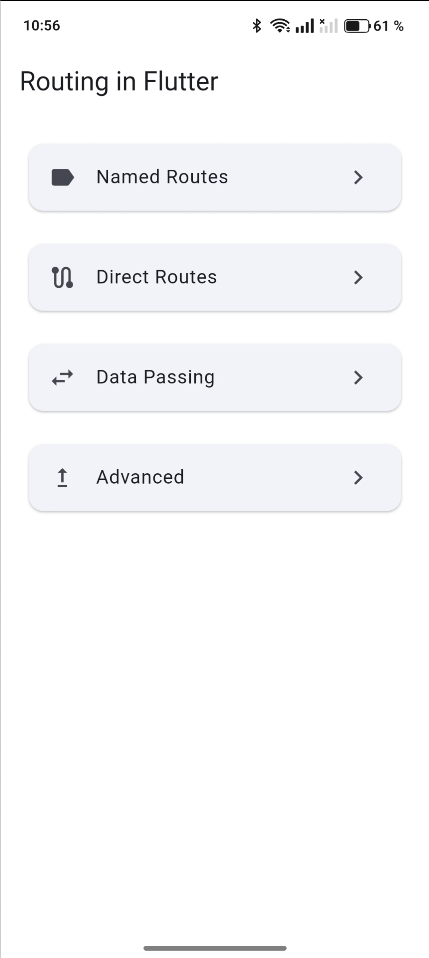
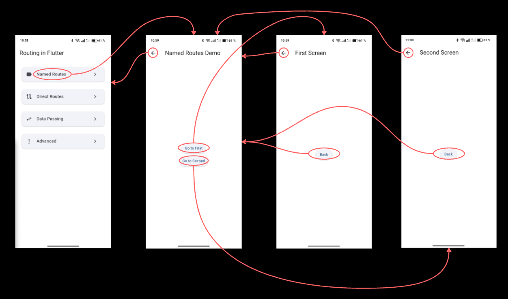
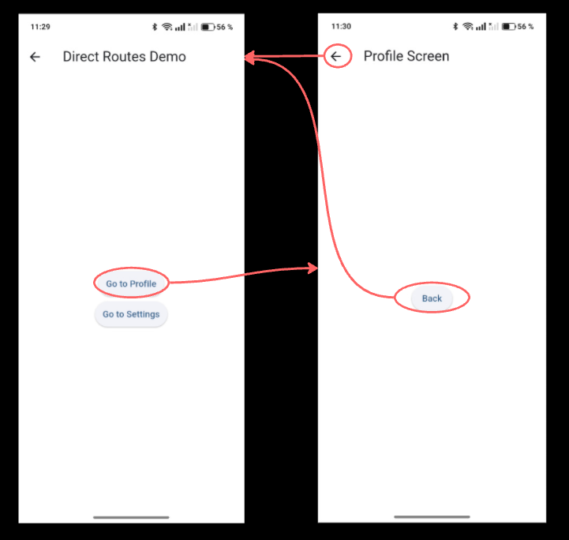
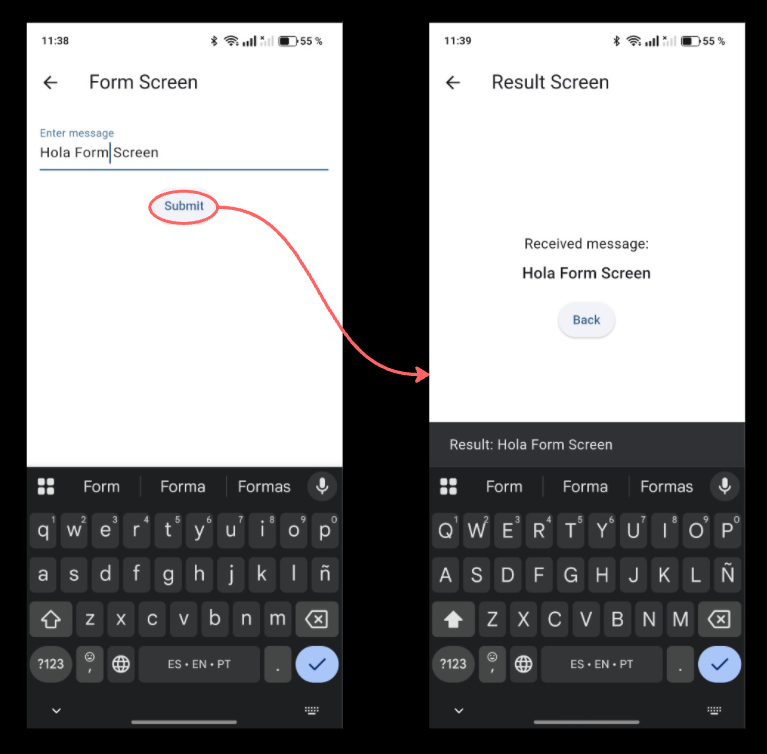
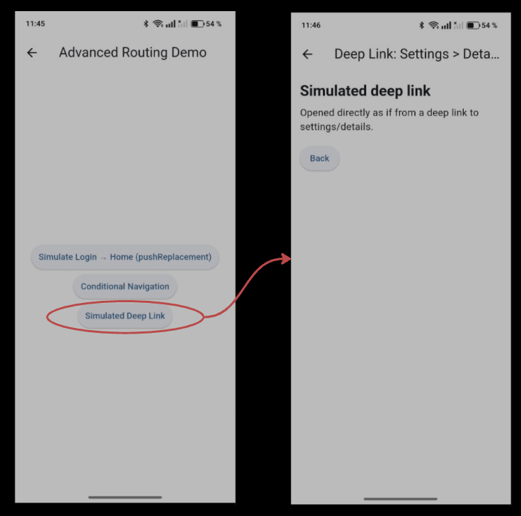

# Routing in Flutter
Una demostración completa de patrones de enrutamiento y navegación en Flutter, construida como parte del repositorio de aprendizaje Flutter & Dart Labs.

## 📖 Acerca de Este Proyecto

Este mini-ejercicio muestra la implementación profesional de navegación en Flutter, cubriendo todos los conceptos del Módulo 3, notas 6: [Enrutamiento en Flutter](../../../Module3_Working-with-Flutter/notes/6_Routing-in-Flutter.md). Demuestra técnicas de enrutamiento tanto básicas como avanzadas que son esenciales para el desarrollo de aplicaciones móviles modernas.

**Basado en**: Notas del curso [Enrutamiento en Flutter](../../../Module3_Working-with-Flutter/notes/6_Routing-in-Flutter.md)

## Características

### Navegación Core
- **Rutas Nombradas**: Gestión centralizada de rutas con identificadores de cadena
- **Rutas Directas**: Creación dinámica de rutas usando MaterialPageRoute
- **Clase Navigator**: Operaciones push y pop para transiciones de pantalla

### Patrones Avanzados
- **Paso de Datos**: Transferir datos entre pantallas (ida y vuelta)
- **Reemplazo de Pantalla**: Reemplazar pantalla actual sin navegación hacia atrás
- **Navegación Condicional**: Enrutamiento basado en estado de la aplicación
- **Simulación de Deep Linking**: Navegación directa a pantallas anidadas (simulado mediante estructura de rutas)

## 🎯 Objetivos de Aprendizaje

Después de explorar este proyecto, comprenderás:
- Cómo implementar rutas nombradas para navegación escalable
- Cuándo usar rutas directas vs rutas nombradas
- Cómo pasar y recuperar datos entre pantallas
- Mejores prácticas para gestión de la pila de navegación
- Patrones profesionales de enrutamiento usados en aplicaciones de producción

## Qué Demuestra Este Proyecto

- [x] Rutas nombradas con un mapa centralizado (`MaterialApp.routes`)
- [x] Rutas directas con `MaterialPageRoute` para pantallas que reciben datos
- [x] Paso de datos ida y vuelta (`Navigator.push` + `Navigator.pop` con resultado)
- [x] Reemplazo de pantalla con `Navigator.pushReplacement`
- [x] Navegación condicional basada en estado local
- [x] Simulación de deep link navegando a una pantalla anidada

## Primeros Pasos

### Prerequisitos
- Flutter SDK 3.22.0 o superior
- Dart 3.0.0 o superior

### Instalación

```bash
# Clonar el repositorio
git clone https://github.com/marcdevelopez/flutter-dart-labs.git

# Navegar al directorio del proyecto
Dentro del repo, desde la raiz, en terminal:
cd mini_exercises/module3_working-with-flutter/routing_in_flutter

# Obtener dependencias
flutter pub get

# Ejecutar la aplicación
flutter run
```

## 📱 Estructura de la Aplicación

```
Pantalla Principal
├── Demo de Rutas Nombradas
│   ├── Primera Pantalla → Segunda Pantalla
│   └── Navegar hacia atrás
├── Demo de Rutas Directas
│   ├── Pantalla de Perfil
│   └── Pantalla de Configuración
├── Demo de Paso de Datos
│   ├── Entrada de Formulario → Mostrar Resultado
│   └── Recuperación de datos
└── Navegación Avanzada
    ├── Reemplazo de Pantalla (Login → Home)
    ├── Simulación de Deep Linking
    └── Navegación Condicional (estado local)
```

### Diagrama de Flujo de Rutas

```
          [Home Screen '/']
                 |
     +-----------+-----------+-----------+
     |           |           |           |
[Named Demo] [Direct]   [Data]    [Advanced]
     |           |           |           |
 [/named/*]  [push()]   [Form→Result] [Conditional]
     |                                   |
[First→Second]                    [pushReplacement]
```

## Stack Técnico

- **Framework**: Flutter 3.22.0+
- **Lenguaje**: Dart 3.0.0+
- **Diseño**: Material Design 3
- **Arquitectura**: Arquitectura basada en componentes de Widgets

## 🎨 Tema Material 3

- `useMaterial3: true` con paleta basada en `ColorScheme.fromSeed`
- `seedColor`: `Colors.blue`, `secondary`: `Colors.amber`
- Superficie y fondo: `surface` gris claro (`grey.shade100`), `background` blanco
- Cards: `cardColor` gris claro, `margin` `EdgeInsets.all(8)`, borde redondeado de 12 px
- Botones elevados: `padding` horizontal 12 px, vertical 8 px (estilo consistente en todos los flujos)

## 📚 Documentación

- [ROADMAP.md](ROADMAP.md) - Hoja de ruta del desarrollo del proyecto
- [SPECS.md](SPECS.md) - Especificaciones técnicas
- [DEV_LOG.md](DEV_LOG.md) - Registro de desarrollo y progreso

## 🎨 Capturas de Pantalla

Cada una de las capturas ilustra el flujo principal del módulo correspondiente:

| Flujo | Captura |
| --- | --- |
| Home |  |
| Named flow |  |
| Direct routes |  |
| Data passing |  |
| Advanced patterns |  |

## 🧭 Cómo Probar los Flujos

- Home → Named: desde el menú principal entra a “Named Routes” y navega First ↔ Second con el back stack.
- Home → Direct: abre “Direct Routes” y navega a Profile y Settings usando `MaterialPageRoute`, vuelve con back.
- Home → Data: entra a “Data Passing”, escribe un mensaje, envía, verifica el SnackBar y la Result Screen.
- Home → Advanced:
  - Login/Home: pulsa “Simulate Login → Home (pushReplacement)” y comprueba que no regresas al login con back.
  - Conditional: activa el switch y abre la pantalla protegida; con el switch off, el botón queda deshabilitado.
  - Deep Link: abre “Simulated Deep Link” para saltar directo a la pantalla anidada.

---

## 📝 Ejemplos de Código

### Rutas Nombradas
```dart
// Definir rutas
MaterialApp(
  initialRoute: '/',
  routes: {
    '/': (context) => HomeScreen(),
    '/second': (context) => SecondScreen(),
  },
);

// Navegar
Navigator.pushNamed(context, '/second');
```

### Rutas Directas
```dart
// Navegar con MaterialPageRoute
Navigator.push(
  context,
  MaterialPageRoute(builder: (context) => ProfileScreen()),
);
```

### Paso de Datos
```dart
// Pasar datos hacia adelante
Navigator.push(
  context,
  MaterialPageRoute(
    builder: (context) => ResultScreen(data: '¡Hola!'),
  ),
);

// Recuperar datos al volver
final result = await Navigator.push(
  context,
  MaterialPageRoute(builder: (context) => FormScreen()),
);
```

## 🚧 Limitaciones

Este proyecto está diseñado con propósitos educativos y tiene las siguientes limitaciones intencionadas:

- **Deep Linking**: Es una simulación mediante estructura de rutas, **no es deep linking real a nivel de sistema operativo**
- **Navegación Condicional**: Usa estado booleano local simple, no autenticación real (Firebase, etc.)
- **Navegación Anidada**: Solo conceptual, no se implementan tabs con navegación independiente
- **Compatibilidad Web**: Puede variar en ejemplos avanzados de routing

## Contribuciones

Este es un proyecto de aprendizaje, pero sugerencias y mejoras son bienvenidas. Siéntete libre de:
- Abrir una incidencia para bugs o preguntas
- Enviar un pull request para mejoras
- Compartir tu feedback [contacto@marcdevelopez.com](mailto:contacto@marcdevelopez.com)

## 📄 Licencia

Este proyecto es parte del repositorio educativo Flutter & Dart Labs.

## Agradecimientos

- Equipo de Flutter por la excelente documentación
- Equipo de Material Design por las guías de diseño

## 📧 Contacto

**Desarrollador**: Marcos García  
**Repositorio**: [flutter-dart-labs](https://github.com/marcdevelopez/flutter-dart-labs)  
[contacto@marcdevelopez.com](mailto:contacto@marcdevelopez.com)

<br>

---
