# 🧩 Depurando aplicaciones Dart con Visual Studio Code

En este laboratorio, aprenderás a usar las herramientas de depuración integradas en Visual Studio Code para inspeccionar, ejecutar paso a paso y corregir errores en una aplicación Dart.

Utilizarás un pequeño programa con un error intencional (bug) para aprender cómo colocar breakpoints, examinar variables, seguir el flujo del programa y aplicar correcciones. El archivo complex_debug.dart dentro de /lib contiene ahora el error en la línea 15, así podrás ir directamente al error, aunque en el lab se te guiará para que lo crees desde 0 en un nuevo proyecto en Visual Studio Code.

---

## 🪜 Paso 1: Crear un nuevo proyecto Dart

En este lab tienes ya el archivo creado y listo para probar, pero si lo deseas puedes crear tu propio proyecto siguiendo esta guía que te dejo a continuación:

Puedes abrir Visual Studio Code en la carpeta que desees dentro de tu sistema, y abrir una terminal en el propio entorno de VSC:

<div align="center">
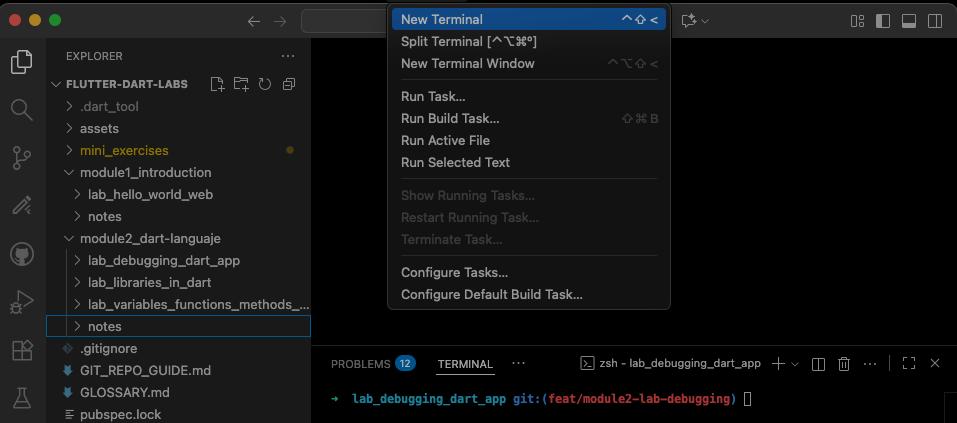
</div>
<br>

Ahora, puedes crear un nuevo proyecto ejecutando el siguiente comando en la terminal:  
Esto generará una nueva carpeta llamada `dart_debug` con la estructura básica de un proyecto Dart, como puedes ver en esta imagen de mi sistema:

```bash
dart create dart_debug
```

En esta imagen me encontraba dentro de este mismo directorio en mi entorno Git, y lo que ves es el resultado del comando dart create. Este proyecto es el mismo en el que te encuentras ahora, pero en ese momento estaba trabajando en una rama de Git específica para subir este laboratorio de forma ordenada al repositorio en GitHub, desde el cual estás viendo este contenido.

<div align="center">
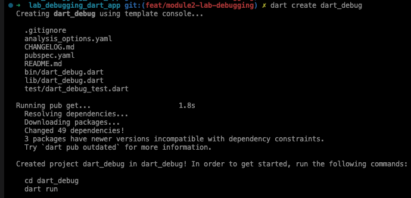
</div>
<br>

Este comando ha creado un nuevo directorio para tu aplicación y varios archivos.  
Navega hasta tu nuevo directorio de proyecto ejecutando:

```bash
cd dart_debug
```

Puedes usar el siguiente listado para ver los archivos creados:

- **`pubspec.yaml`**: Este archivo sirve como manifiesto del proyecto. Incluye metadatos como el nombre, la versión y las dependencias. Es utilizado por el gestor de paquetes de Dart para administrar los paquetes de los que depende tu proyecto.

- **`lib/`**: Este directorio contiene el código público de Dart del proyecto. En la mayoría de los casos, los archivos Dart principales (como `main.dart`) se colocan aquí. Para una aplicación o paquete típico, este es el punto de entrada.

- **`bin/`**: Este directorio contiene los archivos Dart ejecutables. Estos archivos se utilizan como puntos de entrada para aplicaciones de línea de comandos o de servidor, a diferencia de `lib/`, que está destinado al código de biblioteca.

- **`analysis_options.yaml`**: Este archivo se utiliza para configurar la herramienta de análisis estático de Dart. Puedes personalizar las reglas para seguir directrices específicas o ignorar ciertas reglas en todo tu proyecto.

- **`README.md`**: Archivo en formato Markdown que normalmente contiene una descripción general del proyecto, cómo configurarlo y cómo usarlo. Generalmente es el primer archivo que los usuarios o colaboradores leen al acceder a tu repositorio.

- **`CHANGELOG.md`**: Este archivo Markdown registra todos los cambios realizados a lo largo del tiempo en el proyecto. Incluye actualizaciones, correcciones y otras notas importantes que ayudan a los usuarios a conocer qué ha cambiado de una versión a otra.

- **`test/`**: Contiene archivos Dart para realizar pruebas del proyecto o de sus bibliotecas. Dart usa un paquete de pruebas llamado `test` para escribir y ejecutar pruebas unitarias de forma potente.

- **`pubspec.lock`**: Este archivo es generado automáticamente por el gestor de paquetes de Dart e incluye una lista de todos los paquetes de los que depende la aplicación, junto con las versiones específicas que se instalaron. Esto garantiza entornos consistentes y control de versiones para todas las dependencias del proyecto.

---

## 🧩 Paso 2: Verifica el entorno de depuración

Asegúrate de que la extensión de **Dart** esté instalada en el entorno Cloud IDE siguiendo estos pasos:

1. Abre la vista de **Extensiones** haciendo clic en el icono cuadrado de la barra lateral o presionando **Ctrl + Shift + X**.
2. Busca **“Dart”** e instala la extensión si aún no está instalada.

   <br>
   <div align="center">
   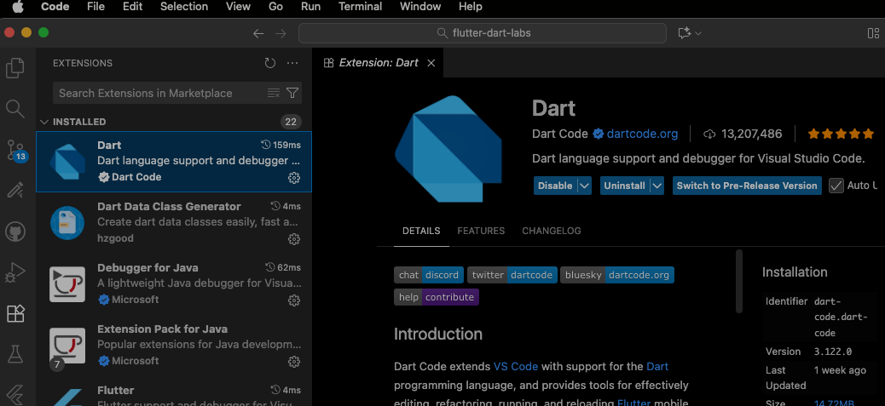
   </div>

---

## 🪜 Paso 3: Crea un archivo complex Dart app

Recuerda que este contenido tiene un error lógico, que no se verá en compilación, para poder realizar estas pruebas de depuración.

### **Entendiendo la lógica del juego**

Antes de comenzar a programar, revisemos qué hace la aplicación de Dart.
Este programa simula un sencillo juego de aventuras basado en texto donde el jugador puede realizar diferentes acciones representadas por una enumeración: **moverse, tomar, abrir y mirar**.  
El jugador comienza en una ubicación específica llamada “inicio” (_start_) y puede moverse a otras ubicaciones predefinidas como “bosque” (_forest_) y “cabaña” (_cabin_) al realizar acciones.
Cada acción afecta el estado del juego:

- **Move (Moverse):** Cambia la ubicación actual del jugador a una nueva. Por ejemplo, pasar de “inicio” a “bosque”.
- **Take (Tomar):** Intenta recoger un objeto. En el bosque, el jugador puede encontrar un tesoro oculto si está en el lugar correcto.
- **Open (Abrir):** Abre algo en la ubicación actual. Por ejemplo, si el jugador está en la “cabaña”, puede abrir su puerta.
- **Look (Mirar):** Proporciona una descripción del lugar actual, ayudando al jugador a entender dónde está y sugiriendo posibles acciones.

El juego está diseñado para recorrer estas acciones en bucle según las entradas del jugador, actualizando y respondiendo a sus acciones.
Sin embargo, un error tipográfico en el código desvía una de las acciones, provocando un comportamiento incorrecto del juego.  
Tu tarea será ejecutar el juego, identificar por qué una acción esperada no produce el resultado correcto y corregir el error utilizando las herramientas de depuración de VS Code.

### **Crea y ejecuta la aplicación**

1. Crea un nuevo archivo Dart llamado **`complex_debug.dart`** dentro de tu carpeta **`lib`**. Estando dentro de tu proyecto Dart, ejecuta el comando:

   ```
   touch /lib/complex_debug.dart
   ```

2. Inserta el siguiente código, que simula un sencillo juego basado en texto con un error lógico intencionado para depurar:

   ```dart
   // Define an enum for different game actions
   enum Action { move, take, open, look }

   // Class to simulate game logic
   class Game {
     // Store player's current location
     String location = 'start';

     // Process actions taken by the player
     void handleAction(Action action) {
       switch (action) {
         case Action.move:
           location = 'forrest';  // Intentional typo in location name.
           break;
         case Action.take:
           if (location == 'forest') {
             print('You found a hidden treasure!');
           } else {
             print('There is nothing to take here.');
           }
           break;
         case Action.open:
           if (location == 'cabin') {
             print('You opened the cabin door.');
           } else {
             print('There is no cabin here to open.');
           }
           break;
         case Action.look:
           print('You are at $location');
           break;
         default:
           print('Unknown action.');
       }
     }

     // Start the game loop
     void start() {
       print('Game started. You are at the $location.');
       handleAction(Action.move);
       handleAction(Action.look);
       handleAction(Action.take);
     }
   }

   void main() {
     var game = Game();
     game.start();
   }
   ```

### **Paso 4: Ejecuta y observa el programa**

1. **Abre el terminal** (si lo habías cerrado anteriormente).

2. **Ejecuta el programa** escribiendo el siguiente comando:

   ```bash
   dart run lib/complex_debug.dart
   ```

3. **Observa la salida**.  
    Verás mensajes que indican tus acciones y ubicación, como por ejemplo:
   “You are at forrest.”
   Sin embargo, el resultado esperado debería ser:
   “You are at forest.”

   Esta diferencia se debe a **un error tipográfico (typo)** en el método `handleAction`, dentro del caso `move`, donde la palabra **"forest"** se escribió incorrectamente como **"forrest"**.

   Este error impide que la acción **`take`** encuentre el tesoro oculto, ya que la condición del código comprueba si la ubicación es `"forest"` (y no `"forrest"`).

   Deberías ver una salida similar a esta:

   ```bash
   Game started. You are at the start.
   You are at forrest
   There is nothing to take here.
   ```

   **Esto no parece correcto.**
   Se supone que el usuario debe encontrar un tesoro cuando está en el bosque.  
   ¡Veamos si podemos depurar esto!

<br>

---

## 🪜 Paso 5: Lanzar el depurador

Una vez creado el archivo de configuración, puedes iniciar la depuración haciendo clic derecho en el archivo Dart y seleccionando:

**Start Debugging**

o mediante el menú:

`Run → Start Debugging`

<div align="center">
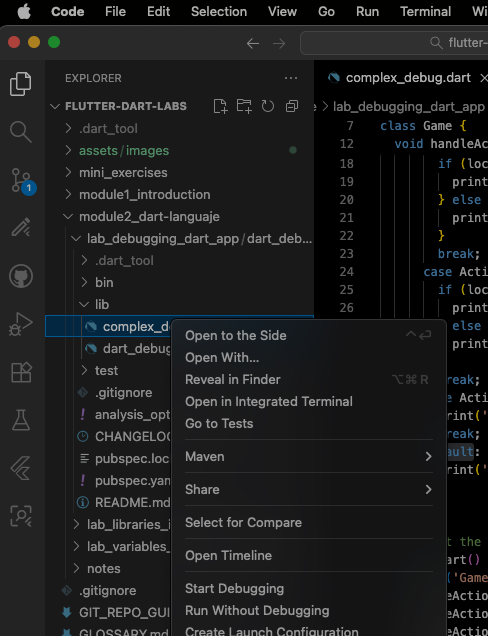
</div>
  
<br>

Esto abrirá la vista del depurador:  
<br>

<div align="center">
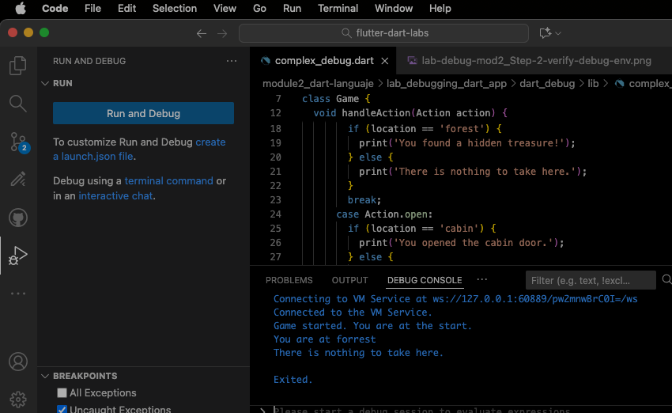
</div>

<br>
No queremos tener que hacer clic derecho cada vez.

Así que, en su lugar, crearemos una configuración de ejecución (**launch configuration**) para depurar el archivo **`complex_debug.dart`**.

Haz clic derecho sobre el archivo y selecciona:

**Create Launch Configuration** (Crear configuración de ejecución)

<br>

<div align="center">
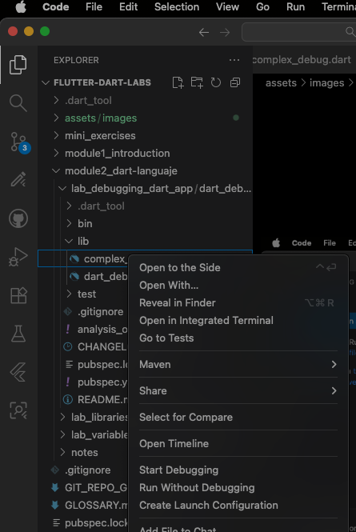
</div>
<br>

Esto creará una nueva configuración en el archivo **`launch.json`**.

<div align="center">
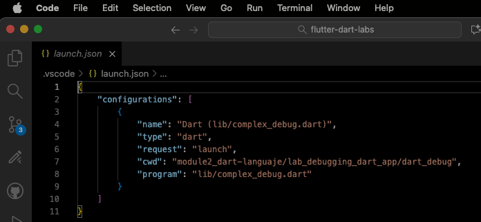
</div>
<br>

Tu salida puede verse un poco diferente, ya que las versiones actuales de VS Code y de la extensión de Dart podrían haber cambiado desde que se escribió este laboratorio.

A partir de ahora, simplemente puedes seleccionar esta configuración para depurar el archivo.

<div align="center">
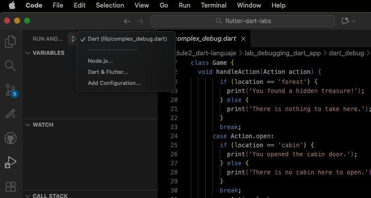
</div>
<br>

En la barra lateral izquierda, haz clic en el icono de **Depuración (Debug)**.

Luego selecciona la configuración **Dart (lib/complex_debug.dart)** para ejecutar el depurador.

---

### **Paso 6: Uso de puntos de interrupción (breakpoints)**

Coloca un **punto de interrupción** en la línea dentro del método **`handleAction`**, donde se realiza la comparación de ubicación
(`if (location == 'forest')`).

Hay varias formas de establecer un breakpoint:

- Haz clic en el **margen izquierdo** (gutter) junto a una línea de código, como se muestra en la imagen inferior.
- O bien, haz **clic derecho** en el margen y selecciona **Add Breakpoint**.

<div align="center">
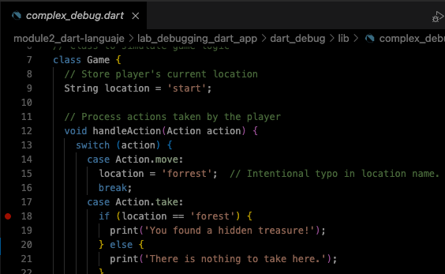
</div>

<br>  
<br>

**Ejecuta tu aplicación.**

La ejecución se detendrá cuando alcance el punto de interrupción, permitiéndote inspeccionar por qué la acción **‘take’** no produce la salida esperada, a pesar de que la acción **‘move’** supuestamente mueve al jugador al **‘forest’**.

<div align="center">
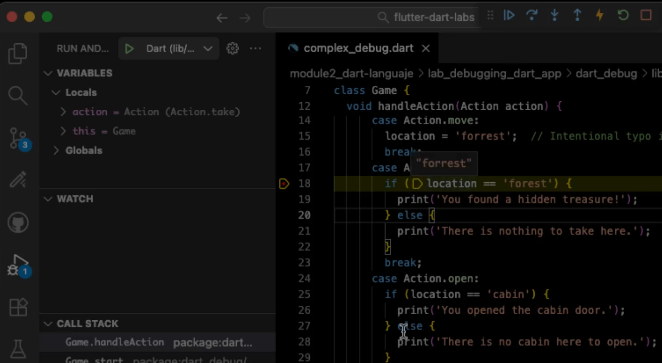
</div>

---

## 🪜 Paso 7: Inspeccionar las variables

En el panel **WATCH**, busca el valor de `location`.  
Verás que su valor actual es `'forrest'`, lo que explica por qué el bloque del `if` no se ejecuta.

<div align="center">
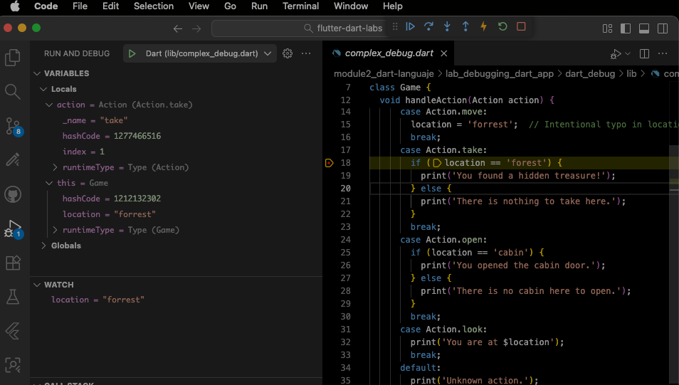
</div>
<br>

Si ejecutas la configuración de depuración nuevamente, verás el valor de la variable **`location`** cuando se active el punto de interrupción.
<br>

<div align="center">
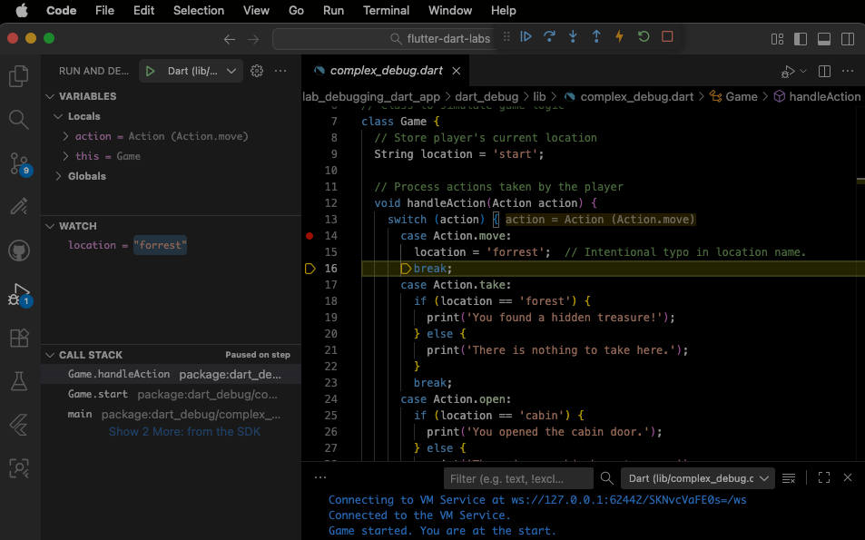
</div>
<br>

Una vez que alcances un punto de interrupción, puedes usar la barra de herramientas para avanzar paso a paso usando el botón **Step Over**.  
También puedes entrar en las funciones y métodos utilizando los botones **Step Into** y **Step Out**.
<br>

<div align="center">
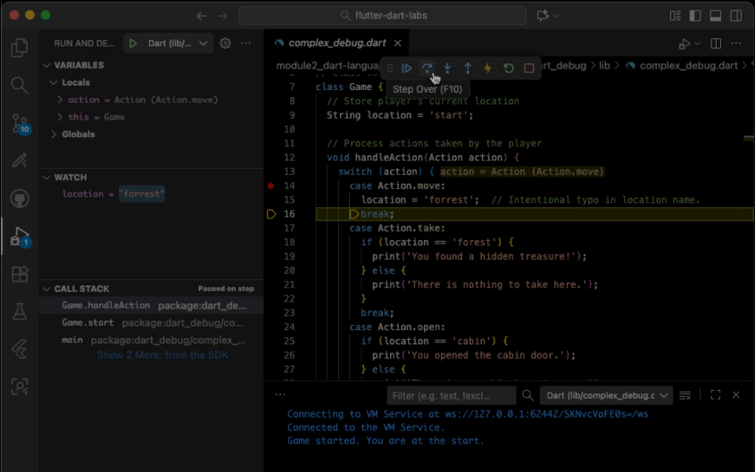
</div>
<br>

---

## 🪜 Paso 8: Corregir el error y volver a ejecutar

Detén la depuración (Shift + F5).
Corrige la línea:

```dart
location = 'forest';
```

<br>
<div align="center">

</div>
<br>

Guarda y ejecuta nuevamente:

```bash
dart run lib/complex_debug_fixed.dart
```

Ahora verás la salida correcta:

```
Game started. You are at the start.
You are at forest
You found a hidden treasure!
```

## **Conclusión y próximos pasos**

Aquí tienes algunos pasos enfocados que puedes seguir para ampliar tus habilidades de depuración después de completar este laboratorio:

- Investiga el uso de **breakpoints condicionales**, que solo se activan bajo condiciones específicas (como ciertos valores de variables o llamadas a funciones concretas), para manejar mejor escenarios de depuración complejos.
- Practica usando el **panel de observación (watch panel)** para monitorear los cambios en variables o expresiones clave a lo largo del tiempo, lo cual es especialmente útil en bucles o durante llamadas repetitivas a funciones.
- Utiliza las herramientas de depuración para avanzar paso a paso por código asíncrono, entender cómo **Dart maneja las operaciones async**, y examinar el estado de los **futures** y **streams**.
- Dado que Dart puede compilar a JavaScript, practica depurar la aplicación en diferentes navegadores para comprender cómo se pueden diagnosticar y resolver los problemas de compatibilidad entre ellos.

  ¡Hazmelo saber si obtienes resultados interesantes o si tienes algún problema!

---

<br>

**¡Felicidades por completar este laboratorio!**

Has aprendido a configurar y utilizar las herramientas de depuración en Visual Studio Code para encontrar y corregir errores en una aplicación Dart.
Esta habilidad es fundamental para desarrollar aplicaciones **robustas y eficientes**.

---
